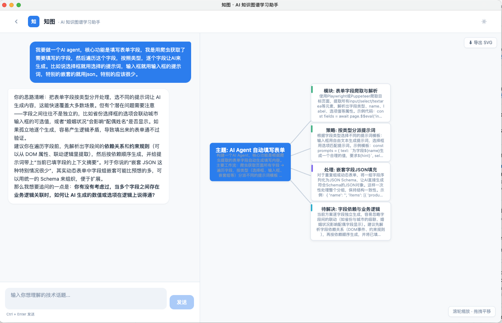
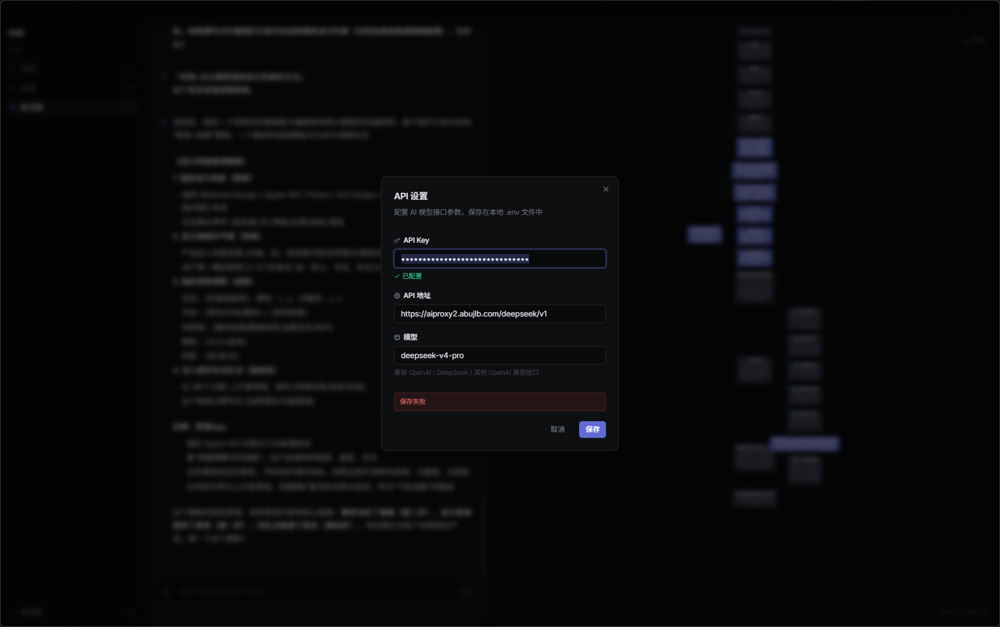

# 知图 · AI 知识图谱学习助手

通过 AI 对话帮你梳理技术知识，自动生成结构化知识图谱（思维导图），把零散的学习变成清晰的脉络。

> 两个独立 Agent 协作 —— 一个负责对话引导，一个专门维护知识图谱。不是套壳聊天。

## 预览





## 为什么做

学新技术时的痛点：看了很多文章脑子还是一团浆糊，和 AI 聊完就忘，知识没有沉淀。

知图把「对话学习」和「知识图谱」绑在一起 —— 左边聊，右边自动长出结构化图谱。学完一个话题，图就是你的笔记。

## 功能

- **AI 引导式学习**：先解答再追问，每次只问一个问题，逐步深入
- **知识图谱自动生成**：思维导图树形展开，概念层级一目了然
- **双 Agent 架构**：对话 Agent + 图谱编辑 Agent 分离，各司其职
- **增量更新**：追加、修改、删除节点，不整图重建
- **Markdown 渲染**：代码块、标题、列表、引用
- **节点选中讨论**：点击图谱节点可将其加入对话上下文
- **自动标题**：首次对话自动生成话题标题
- **历史记录**：所有学习话题独立保存，断点续聊
- **导出 SVG**：完整导出知识图谱
- **桌面应用**：Electron 打包，双击即用
- **支持 OpenAI 兼容 API**：OpenAI / DeepSeek 等

## 技术栈

| 层 | 技术 |
|---|---|
| 前端 | React 18 + TypeScript + Tailwind CSS + Zustand |
| 图渲染 | SVG 树形布局 |
| 后端 | FastAPI + SSE 流式传输 |
| 数据库 | SQLite + SQLAlchemy |
| 桌面端 | Electron |
| AI | OpenAI SDK（兼容 DeepSeek 等） |

## 快速开始

### 前提

- Python 3.9+
- Node.js 18+
- OpenAI 兼容的 API Key

### 1. 安装

```bash
git clone https://github.com/your-username/zhitu.git
cd zhitu

cd backend && pip install -r requirements.txt
cd ../frontend && npm install
```

### 2. 配置

编辑 `backend/.env` 或在 UI 设置面板中配置：

```env
OPENAI_API_KEY=sk-your-key-here
OPENAI_BASE_URL=https://api.openai.com/v1
OPENAI_MODEL=gpt-4o
```

### 3. 启动

**浏览器模式：**
```bash
cd backend && python3 -m uvicorn main:app --port 18674 --reload
cd frontend && npm run dev
```
打开 `http://localhost:5173`

**桌面应用：**
```bash
cd frontend && npm run electron:dev
```

## 项目结构

```
zhitu/
├── backend/
│   ├── main.py              # FastAPI 入口 + SSE
│   ├── socratic_agent.py    # 双 Agent：对话 + 图谱编辑
│   ├── models.py            # ORM
│   └── requirements.txt
├── frontend/
│   ├── src/
│   │   ├── components/
│   │   │   ├── ChatPanel.tsx    # 对话面板 + SSE
│   │   │   ├── MindCanvas.tsx   # SVG 图谱渲染
│   │   │   ├── HistoryPage.tsx  # 历史记录
│   │   │   └── SettingsPanel.tsx
│   │   ├── store/scriptoriumStore.ts
│   │   └── api.ts
│   └── package.json
├── electron/main.cjs
└── README.md
```

## 架构

```
用户输入 → Agent 1 对话助手（流式）→ 用户看到回复
                                 → Agent 2 图谱编辑器 → 知识图谱更新
```

## License

Apache License 2.0
